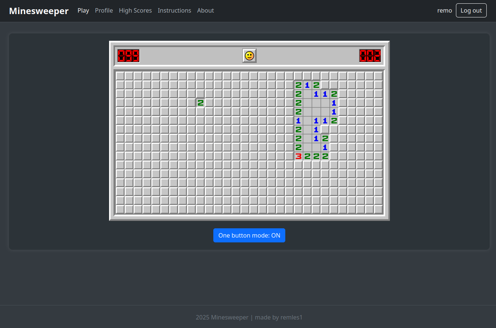

<!-- Improved compatibility of back to top link: See: https://github.com/othneildrew/Best-README-Template/pull/73 -->
<a id="readme-top"></a>
<!--
*** Thanks for checking out the Best-README-Template. If you have a suggestion
*** that would make this better, please fork the repo and create a pull request
*** or simply open an issue with the tag "enhancement".
*** Don't forget to give the project a star!
*** Thanks again! Now go create something AMAZING! :D
-->
<!-- PROJECT LOGO -->


<h1 align="center">Minesweeper</h1>
<div align="center">
  
</div>

<!-- ABOUT THE PROJECT -->
## About The Project

An online platform for playing the classic Minesweeper game. Features include post-game statistics, a global leaderboard showcasing top performances, and player profiles with best time tracking.

This project is NOT production ready. It's just a hobby project that I made for educational purposes. Some parts of the code need refactoring, like for example the websocket consumer which is too bulky. The project served it's educational purpose and I've moved on to more difficult projects now. Apart from the game itself which I carefully put together, frontend is pure programmer art.

<p align="right">(<a href="#readme-top">back to top</a>)</p>


### Built With

* [![Django][Django-shield]][Django-url]
* ![JS][JS-shield]
* [![PostgreSQL][PostgreSQL-shield]][PostgreSQL-url]
* HTML/CSS
<p align="right">(<a href="#readme-top">back to top</a>)</p>

## Gallery
<p align="center">
    
</p>

<p align="center">
    
</p>

<p align="center">
    
</p>

<p align="center">
    
</p>

<p align="center">
    
</p>


<p align="right">(<a href="#readme-top">back to top</a>)</p>

<!-- GETTING STARTED -->
## Getting Started
### Prerequisites 
* Python 3.12.7
* Django 5.1.4
* django-registration==5.1.0
* channels[daphne]==4.2.0
* psycopg==3.2.3
* psycopg-binary==3.2.3

* PostgreSQL 17.0
This docker-compose.yml will work out of the box:
	```yml
	services:
	    minesweeperdb:
	        image: postgres:17.0-alpine3.20
	        environment:
	        - POSTGRES_DB=app
	        - POSTGRES_USER=postgres
	        - POSTGRES_PASSWORD=pass
	        container_name: minesweeperdb
	        ports:
	        - "5432:5432"
	        command: ["postgres", "-c", "log_statement=all"]
	```


### Installation
1. Clone the repo
   ```sh
   git clone https://github.com/remles1/minesweeper-django.git
   ```
2. Make migrations
   ```sh
   python manage.py makemigrations
   ```
3. Migrate
   ```sh
	python manage.py migrate
   ```
3. Run dev server
   ```sh
	python manage.py runserver
   ```

<p align="right">(<a href="#readme-top">back to top</a>)</p>


<!-- ROADMAP -->
## Features

- [x] Game logic
	- [x] One button controlls
	- [x] Post game statistics
		- [x] Player best tracking for every statistic
- [x] Account support
	- [x] Profile page
- [x] Global leaderboard
    - [x] Leaderboard caching

<p align="right">(<a href="#readme-top">back to top</a>)</p>

<!-- MARKDOWN LINKS & IMAGES -->
<!-- https://www.markdownguide.org/basic-syntax/#reference-style-links -->


[Django-shield]: https://img.shields.io/badge/Django-092E20?style=for-the-badge&logo=django&logoColor=green
[Django-url]: https://www.djangoproject.com/
[PostgreSQL-shield]: https://img.shields.io/badge/postgresql-4169e1?style=for-the-badge&logo=postgresql&logoColor=white
[PostgreSQL-url]: https://www.postgresql.org/
[JS-shield]: https://img.shields.io/badge/javascript-black?style=for-the-badge&logo=javascript

